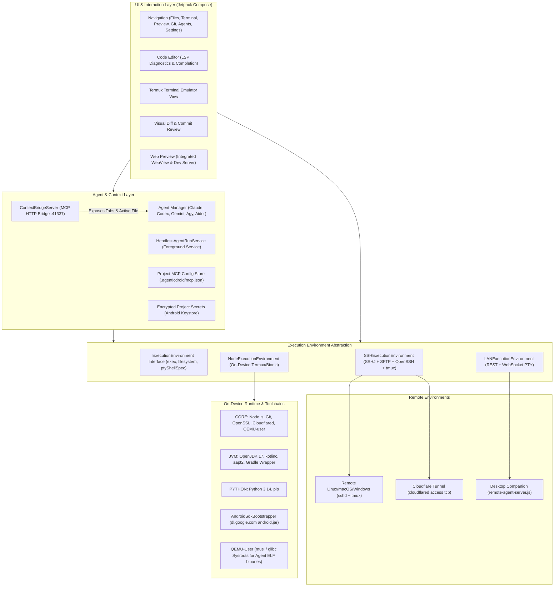
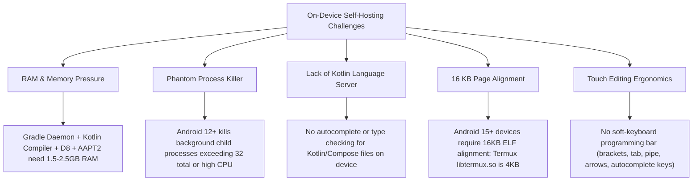
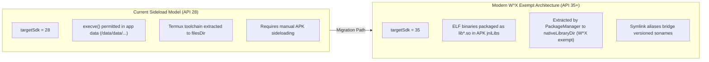
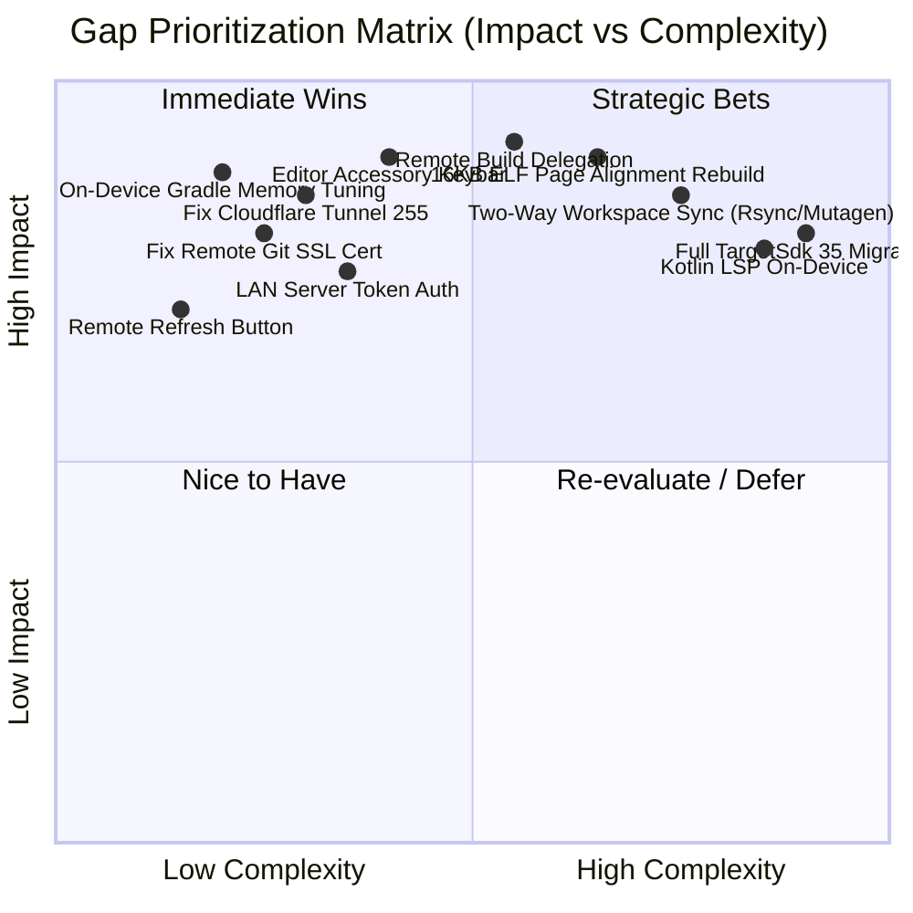

# AgenticDroid Architectural Review: Lightweight Mobile Standalone Agentic IDE

A comprehensive architectural evaluation and strategic roadmap for AgenticDroid as a **lightweight, mobile-first, standalone agentic IDE** capable of on-device self-hosting and elastic remote execution.

---

## 1. Executive Summary

AgenticDroid bridges two emerging software paradigms: **mobile-native development environments** and **agentic AI workflows**. By embedding a Termux Bionic runtime, QEMU user-mode translation, an OpenJDK/Android SDK compilation toolchain, and multi-protocol remote connectivity (SSH, LAN, Cloudflare Tunnels), AgenticDroid achieves a unique capability: **running real AI coding agents (Claude Code, OpenAI Codex, Gemini CLI, Antigravity, Aider) and self-compiling Android applications entirely on an Android device without requiring a desktop host.**

### Capability Maturity Matrix

| Subsystem | Maturity Score | Current State & Strengths | Critical Gaps & Imperatives |
| :--- | :---: | :--- | :--- |
| **Local Agent Runtime** | **8.5 / 10** | Multi-agent support (Claude, Codex, Gemini, Antigravity, Aider), QEMU user-mode emulation for musl/glibc binaries, TUI interactive PTY & Headless background runs. | Memory management during long agent sessions; token usage telemetry; agent checkpointing and rollback. |
| **On-Device Self-Hosting** | **7.5 / 10** | OpenJDK 17 + kotlinc + aapt2 + dynamic Android SDK bootstrapper (`android-37`) + Gradle wrapper + `PackageInstaller` self-update. | High Gradle RAM footprint (~1.5–2.5 GB peak); Android phantom process killer; lack of on-device Kotlin/Java LSP. |
| **Remote Connectivity** | **7.0 / 10** | SSHJ + SFTP batching + OpenSSH PTY + `tmux` persistence + LAN companion server (`remote-agent-server.js`) + Cloudflare tunnel proxy. | Cloudflare tunnel permission/port bug; LAN server lacks authentication; SFTP latency on large trees; no two-way git/mutagen sync. |
| **IDE Editor & Code Navigation** | **5.5 / 10** | Multi-tab Compose `BasicTextField`, regex syntax highlighting, LSP4J client foundation, Search, Web preview. | Pyright only (no Kotlin, TS, Rust LSPs); virtual keyboard ergonomics (quick-symbol bar, indentation aids, breadcrumbs); AST refactoring. |
| **Git & Version Control** | **8.0 / 10** | GitHub OAuth device flow, Keystore credential encryption, porcelain Git parsing, side-by-side Visual Diff dialog. | Git SSL CA cert issue on remote hosts; merge conflict resolver; git submodules. |
| **OS Compliance & Safety** | **6.0 / 10** | Keystore credential isolation; `targetSdk 28` W^X exemption; `nativeLibraryDir` packaging prototype. | `targetSdk 28` limits store distribution; 16 KB page alignment required for Android 15+; background memory killer resilience. |

---

## 2. System Architecture



---

## 3. Developing AgenticDroid On-Device (Self-Hosting Feasibility)

The ability to write, debug, test, and compile AgenticDroid **entirely on an Android phone** is the core test of a standalone mobile IDE.

### 3.1 The Working Chain Today
1. **Source Management:** The app clones its repository via `GitManager` using GitHub OAuth device flow tokens stored securely in the hardware Android Keystore.
2. **Agentic Assistance:** The developer launches Claude Code, OpenAI Codex, Gemini CLI, Antigravity, or Aider against the local workspace (`filesDir/workspaces/AgenticDroid`). The agent directly reads and modifies source files.
3. **Editor & Context:** Open tabs are exposed via `ContextBridgeServer` (port 41337) to MCP-compatible agents.
4. **Toolchain Bootstrapping:**
   - `RunnerPackageGroup.JVM` provides OpenJDK 17 and Termux's Bionic `aapt2`.
   - `AndroidSdkBootstrapper` dynamically fetches `android.jar` (e.g. `platforms;android-37`) from Google repository indexes and generates the license acceptance marker.
   - `NodeRuntime.ensureGradleUserHomeProperties` injects `android.aapt2FromMavenOverride` so Gradle uses the Bionic `aapt2` instead of failing on AGP's default glibc binary.
5. **Build & Package:** Executing `./gradlew assembleDebug` compiles Kotlin, packages resources, and produces `app-debug.apk`.
6. **Self-Installation:** `ApkInstaller.kt` uses Android's `PackageInstaller` session API with `ACTION_INSTALL_PACKAGE` to install the newly built APK over the running instance.

### 3.2 Key Bottlenecks for Standalone Mobile Self-Hosting



#### 1. RAM & Memory Pressure
* **Analysis:** Running an LLM CLI (Node + QEMU) simultaneously with Gradle (`kotlinc` + D8 + AAPT2) can push memory consumption past 3 GB. Mid-range phones (6–8 GB RAM) will experience aggressive Low Memory Killer (LMK) terminations.
* **Mitigation:**
  * Enforce `org.gradle.jvmargs=-Xmx1024m -XX:+UseSerialGC` in on-device `gradle.properties`.
  * Disable the Gradle Daemon for on-device builds (`--no-daemon`) to release JVM memory immediately upon build completion.
  * Implement a "Pre-build pause" that pauses background headless agent runs before kicking off Gradle builds.

#### 2. Android Phantom Process Killer (Android 12+)
* **Analysis:** Android 12 introduced a phantom process killer that terminates any app with >32 spawned child processes or high background CPU usage. A multi-threaded Gradle build and background agent runs can easily trigger this.
* **Mitigation:** AgenticDroid already uses a foreground service with persistent notifications (`HeadlessAgentRunService` and `TerminalService`), but should guide power users to disable phantom process monitoring via wireless ADB / Shizuku if available (`settings put global settings_enable_monitor_phantom_procs false`).

#### 3. 16 KB Page Alignment (Android 15+)
* **Analysis:** Modern devices starting with Android 15 can use 16 KB page sizes. The bundled Termux `libtermux.so` and certain ELF binaries compiled with 4 KB max-page-size will fail to load with `ELF alignment error`.
* **Mitigation:** Recompile native wrappers and Termux native components with `-Wl,-z,max-page-size=16384`.

#### 4. Code Intelligence for Kotlin & Compose
* **Analysis:** Currently, `LspManager.kt` only registers `pyright` for Python files. When working on AgenticDroid in the editor, there is no Kotlin or Java code completion, type inspection, or syntax error highlighting.
* **Mitigation:** Integrate a lightweight Kotlin/Java Language Server or utilize `kotlinc` diagnostics in background lint passes.

---

## 4. Remote Environments & Hybrid Workflows

The remote environment system enables seamless offloading when heavy builds, full Docker environments, or desktop GPUs are available.

### 4.1 Comparison of Remote Execution Modes

| Feature | SSH Environment (`SSHExecutionEnvironment`) | LAN Companion (`LANExecutionEnvironment`) | Cloudflare Tunnel (`cloudflared access tcp`) |
| :--- | :--- | :--- | :--- |
| **Transport** | SSH protocol (SSHJ library / OpenSSH binary) | HTTP REST + WebSocket | TCP over HTTP/2 WebSocket tunnel to SSH |
| **Host Requirements** | Standard SSH daemon (Linux, macOS, Windows) | Node.js + `remote-agent-server.js` | `cloudflared` installed on remote & device |
| **File Operations** | SFTP (batched via `SSHFileSystemAccess`) | REST endpoints (`/api/files/*`) | SFTP through SSH over tunnel |
| **Session Persistence**| `tmux` / `screen` auto-reattachment | WebSocket re-connection (PTY alive on host) | `tmux` / `screen` over tunnel |
| **Port Forwarding** | Built-in `-L` forwarding (5173, 3000, 8080, etc.) | N/A (requires reverse proxy or direct LAN) | Built-in via SSH `-L` |
| **Security** | Host key SHA-256 fingerprint + Keystore keys | **None (Plain HTTP on LAN)** | Zero-trust authentication via Cloudflare |

### 4.2 Known Edge Cases & Technical Fixes

#### 1. Cloudflare Tunnel Terminal Exit Code 255 / Permission Denied
* **Root Cause:** In `SSHExecutionEnvironment.kt`, when `useCloudflareTunnel` is active, the interactive PTY generates an `ssh` command with `ProxyCommand=cloudflared access tcp --hostname <host>`. If the local `cloudflared` executable in `node-runtime/usr/bin/cloudflared` lacks execute permissions (`chmod 755`), or if `cloudflared` fails to locate credentials in `$HOME/.cloudflared`, `ssh` immediately exits with code `255`.
* **Fix:** Enforce `cloudflared.setExecutable(true, true)` upon toolchain bootstrap, verify local tunnel port listening readiness before launching the PTY, and capture tunnel stderr for visible diagnostics.

#### 2. Git SSL CA Certificate Access Failure
* **Root Cause:** In `GitManager.kt`, Git HTTPS requests against `github.com` fail with `Problem with the SSL CA Cert` when `http.sslCAInfo` or `SSL_CERT_FILE` points to an unpopulated or unreadable cert path.
* **Fix:** In `NodeRuntime.kt`, ensure `usr/etc/tls/cert.pem` is always extracted and validated. For remote SSH/LAN environments, nullify `sslCertPath` so the remote system's native CA trust store (`/etc/ssl/certs/ca-certificates.crt` or Windows cert store) is used instead of the local Android path.

#### 3. Remote Project Refresh
* **Requirement:** When working on an SSH or LAN environment, files modified on the remote server (or by remote agent runs) do not trigger local Android filesystem watcher events.
* **Fix:** Add an explicit refresh button and pull-to-refresh gesture in `RemoteBrowserScreen` and `FileTree` that invalidates the cached directory tree via `fetchRemoteTree()` and re-evaluates Git status.

#### 4. LAN Companion Server Security
* **Vulnerability:** `tools/remote-agent-server.js` currently exposes unrestricted filesystem read/write and arbitrary command execution (`/api/exec`) without authentication.
* **Fix:** Implement a pairing token header (`X-AgenticDroid-Token`) generated on desktop startup and scanned via QR code on mobile.

---

## 5. Security & Platform Compliance



1. **W^X Policy & TargetSdk:**
   - AgenticDroid currently targets SDK 28 to permit executing dynamically downloaded binaries in app data.
   - The repository already contains the foundation (`tools/fetch_native_libs.py`, `NodeRuntime.nativeLibBinary`, and `jniLibs/`) to package `node`, `git`, `qemu-user`, `aapt2`, and shared libraries as native `.so` files in `nativeLibraryDir`.
   - **Recommendation:** Continue migrating package groups (Python, JVM) into the native library packaging architecture so that AgenticDroid can raise `targetSdk` to 35+ and run on modern enterprise and managed Android configurations.
2. **Credential Security:**
   - Passwords, SSH private keys, and GitHub OAuth tokens are stored in Android `EncryptedSharedPreferences` backed by the hardware Android KeyStore. This follows best practices on Android.

---

## 6. Comprehensive Gap Analysis



### Detailed Subsystem Breakdown

| Area | Current State | Missing Capability | Impact | Recommended Solution |
| :--- | :--- | :--- | :--- | :--- |
| **Editor UX** | Basic TextField with line numbers | No coding accessory bar (Tab, `{}`, `[]`, `()`, `=>`, `\|`, `<`, `>`, arrows). Virtual keyboard covers text. | High | Add a persistent Compose `LazyRow` above virtual keyboard with developer symbols and auto-indent actions. |
| **Code Nav** | Pyright LSP only | No Kotlin, Java, JavaScript/TypeScript, or Rust language intelligence. | High | Bundle lightweight language servers (`typescript-language-server`, Kotlin LSP) runnable in Termux or remote LSP proxy. |
| **Agent Runs** | Interactive TUI + Headless single prompt | No multi-turn headless conversations, agent undo/rollback, or diff inspection before applying. | High | Introduce an Agent Session Inspector with step-by-step diff review and checkpoint rollbacks. |
| **Hybrid Builds** | On-device Gradle only | No option to delegate `./gradlew assembleDebug` to remote SSH host while editing locally on phone. | Critical | Add "Remote Build & Fetch APK" action: trigger build on SSH server, stream logs, download APK, and auto-install on phone. |
| **Workspace Sync** | Local OR Remote (isolated) | Editing remote files over SFTP has high latency on high-ping connections; no offline editing with remote sync. | Medium | Add two-way synchronization using Git branch synchronization or Rsync/SFTP file batch caching. |
| **LAN Security** | Open HTTP/WS on port 41338 | Anyone on the same WiFi network can read/write files and execute arbitrary commands on the PC. | Critical | Add Bearer token authentication + QR code pairing to `remote-agent-server.js`. |

---

## 7. Actionable Roadmap

```mermaid
timeline
    title AgenticDroid Evolution Roadmap
    section Phase 1 : Reliability & Polish
        Fix Cloudflare Tunnel (Issue 1) : Remote Git SSL Cert (Issue 2) : Remote Project Refresh (Feat 3) : LAN Server Token Pairing
    section Phase 2 : Mobile IDE Ergonomics
        Editor Developer Accessory Keybar : Gradle On-Device Memory Tuning : Background Run Checkpoints : Web Preview Auto-Detection
    section Phase 3 : Hybrid Agentic Engine
        Remote Build Delegation (Build on PC, Install on Phone) : Two-Way Workspace Sync : Multi-Language LSP Expansion (TS & Kotlin)
    section Phase 4 : Platform Future-Proofing
        16 KB ELF Page Alignment : Full nativeLibraryDir TargetSdk 35 Migration : Shizuku Process Management Integration
```

### Phase 1: Core Reliability & Immediate Bug Fixes
1. **Cloudflare Tunnel Fix:** Ensure `cloudflared` binary has execute permissions, verify tunnel readiness via socket probe, and capture stderr for visible user diagnostics.
2. **Remote Git SSL CA Cert Fix:** Ensure `sslCertPath` is properly handled per environment (use local cert on Android, system cert on remote SSH/LAN).
3. **Remote Project Refresh:** Add a refresh button and pull-to-refresh in `RemoteBrowserScreen` and `FileTree`.
4. **LAN Server Hardening:** Add Bearer token authentication to `tools/remote-agent-server.js` and an authorization header in `LANExecutionEnvironment.kt`.

### Phase 2: Mobile Standalone Development Ergonomics
1. **Developer Accessory Keyboard Bar:** Implement a customizable keyboard accessory bar with common programming characters (`{`, `}`, `(`, `)`, `[`, `]`, `;`, `->`, `=>`, `=`, `!`, `&`, `|`, `\`, `$`, tab, indent, dedent, undo, redo, line navigation).
2. **On-Device Gradle Memory & Process Tuning:** Default on-device Gradle execution to `--no-daemon -Dorg.gradle.jvmargs="-Xmx1024m -XX:+UseSerialGC"`.
3. **Agent Transcript & Diff Rollback:** Provide a visual rollback button in `DiffReviewDialog` to discard an agent's changes if an experiment fails.

### Phase 3: Hybrid Elastic Development (Local + Remote Synergy)
1. **Remote Build & Deploy Action:**
   - In `ProjectRunnerAction`, add a "Build Remotely & Install on Device" action for SSH environments: executes `./gradlew assembleDebug` on the fast remote machine, downloads the resulting APK over SFTP to `cacheDir`, and triggers `ApkInstaller.installApk()` on the phone.
   - This provides the best of both worlds: write code and prompt agents on the go from mobile, with desktop/cloud compilation speeds.
2. **Two-Way Workspace Synchronization:**
   - Allow a project to have both a local path and a linked remote path, with one-tap sync (using `git fetch/merge` or batched SFTP sync).

### Phase 4: Long-Term Platform Modernization
1. **16 KB Page Alignment Rebuild:** Update `fetch_native_libs.py` and `fetch_jvm_native_libs.py` to pull 16 KB-aligned Termux/Debian binaries for Android 15+ compatibility.
2. **TargetSdk 35+ Migration:** Complete the packaging of all runner groups into `nativeLibraryDir` via `jniLibs` to eliminate the dependency on `targetSdk = 28`.

---

## 8. Conclusion

AgenticDroid is uniquely positioned as the most capable native Android agentic IDE. Its architecture successfully solves the hardest engineering hurdles on mobile: **executing Bionic/musl/glibc binaries without root, running full Node/Python/JVM toolchains, orchestrating agent CLIs, self-compiling Android applications, and bridging to remote machines over secure tunnels.**

Implementing the ergonomic improvements (developer keybar, Kotlin LSP), tuning on-device memory limits, hardening remote transport reliability, and introducing hybrid Remote Build Delegation will establish AgenticDroid as an uncompromising, state-of-the-art mobile development environment.
